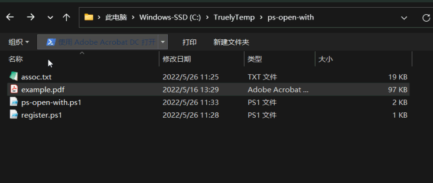

## Powershell Open With Picker

每次打开文件时，都选择关联的应用程序。

用例：在同一个笔记软件中，用与系统默认 PDF 阅读器不同的其他阅读器打开 PDF 文件链接。

类似应用：[sonnyp/Junction: Application/browser chooser (github.com)](https://github.com/sonnyp/Junction)

效果：

使用：

0. 将系统的 Powershell 脚本权限设定为 `unrestricted`： [How to enable execution of PowerShell scripts? - Super User](https://superuser.com/questions/106360/how-to-enable-execution-of-powershell-scripts)
1. 将第一段代码存储为 `ps-open-with.ps1`，第二段代码存储为 `register.ps1`
2. 用文本编辑器打开 `ps-open-with.ps1`，修改头部的打开方式，key 为显示名，value 为程序路径
3. 用文本编辑器打开 `register.ps1`，修改底部的 `{PSFILEPATH}` 为 `ps-open-with.ps1` 的完整路径
4. 打开一个管理员权限的 Powershell 窗口，运行 `register.ps1`。本步骤完成后，右键 PDF 文件，打开方式中应该有 `Windows Powershell`
5. 将 `Windows Powershell` 设定为 PDF 的默认打开方式

代码来源：

- [How to Create a GUI for PowerShell Scripts? – TheITBros](https://theitbros.com/powershell-gui-for-scripts/)

- [windows 10 - How can I associate a file type with a powershell script? - Stack Overflow](https://stackoverflow.com/questions/48280464/how-can-i-associate-a-file-type-with-a-powershell-script)
